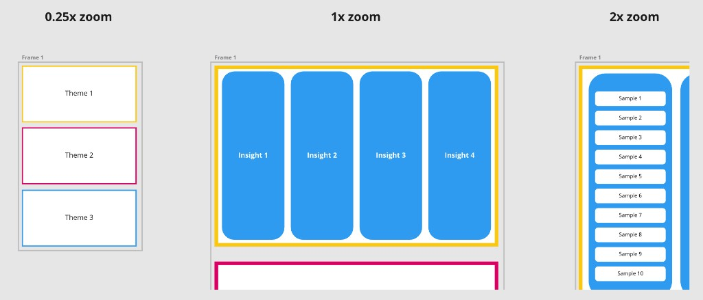

# Whiteboard — Project Plan

An offline-first desktop whiteboard app for **Windows + macOS** that mimics
[miro.com](https://miro.com)'s design, interaction model, and core functionality —
with one headline feature Miro never shipped:

> **Zoom Breakpoints** — control how content appears at different zoom levels,
> so you can explore a data hierarchy by zooming through levels of abstraction.

---

## 1. The core feature: Zoom Breakpoints (semantic zoom)

The defining idea is **semantic zoom** (a.k.a. level-of-detail / LOD rendering),
best framed as:

> **Responsive design, but the axis is _zoom scale_ instead of _viewport width_.**

Just like CSS has breakpoints on screen width, the board has **Zoom Breakpoints**
on scale. The reference example (`docs/assets/zoom-breakpoints-example.png`):

| Zoom | Shows | Abstraction level |
|------|-------|-------------------|
| ≤ 0.25x | **Themes** (3 cards) | high-level synthesis |
| ~ 1x | **Insights** (columns) | mid-level |
| ≥ 2x | **Samples** (detailed list) | raw detail |



### Two paradigms

1. **LOD swap (discrete, the primitive).** An element/frame has multiple
   representations; render the one whose zoom range contains the current scale.
   (Theme card ↔ Insight columns ↔ Sample list.)
2. **Hierarchy-bound zoom (the showcase, built on #1).** A parent abstraction
   *expands into* its children as you zoom in. Zoom depth maps to tree depth.
   Bind a data hierarchy (e.g. univrs.ai analytics) to zoom and auto-generate
   the breakpoints.

Build #1 first as the general primitive; treat #2 as the demo that sells it.

### Design principles (where this feature lives or dies)

- **Global named tiers + per-element overrides.** Define board-level tiers once
  (e.g. `Overview / Normal / Detail` at 25% / 100% / 200%), exactly like
  responsive breakpoints. Each element opts into per-tier behavior:
  *visible/hidden*, *swap content variant*, or *style/size override*.
- **Tier switcher for authoring.** Edit "how the board looks at Overview" while
  viewing at any zoom — never need to physically zoom out to edit the
  zoomed-out representation. (Cf. Figma breakpoint switcher / browser responsive mode.)
- **Hysteresis + crossfade at thresholds.** Add a dead-band around each threshold
  and a short crossfade / scale-morph so content doesn't flicker or pop when the
  zoom hovers near a boundary.
- **Constant-apparent-size content.** Because each tier re-lays-out, content can
  stay readable at every zoom instead of shrinking to nothing.
- **Preload neighbors.** At tier N, keep N±1 warm for instant transitions.

---

## 2. Tech stack

| Layer | Choice | Why |
|-------|--------|-----|
| Desktop shell | **Tauri 2** (Rust core, system webview) | Small binaries, low memory, strong offline story, first-class Win + macOS |
| UI chrome | **TypeScript + React** | Standard, fast iteration |
| Canvas engine | **Konva + `react-konva`** (Canvas2D scene graph) | **Pure MIT** (hard requirement), mature scene graph with events/dragging/transforms, React bindings; we own the model so Zoom Breakpoints are first-class, not bolted on |
| Document model | **Yjs CRDT** (MIT), persisted to local file via Tauri fs | Rock-solid undo/redo, multi-window editing, future offline-first collaboration without re-architecting |

> **License note:** the entire stack is permissive (Konva/Pixi/Yjs/React = MIT,
> Tauri = MIT/Apache-2.0). tldraw was considered for speed but rejected because
> its license requires a watermark/paid license, conflicting with the pure-MIT goal.

### Known trade-offs / risks

- **We build interactions ourselves.** Unlike an all-in-one SDK, Konva gives us a
  scene graph but selection/marquee/snapping/undo are ours to implement. Worth it
  for full control and MIT cleanliness.
- **Canvas2D vs WebGL scale.** Konva (Canvas2D) is plenty for the proof and
  mid-size boards; **PixiJS (WebGL, also MIT)** is the escape hatch if object
  counts demand it.
- **Transition feel** (hysteresis + crossfade) is the make-or-break detail — budget real time.
- **macOS signing/notarization** is a packaging chore for a later phase, not the spike.

---

## 3. Data model (sketch)

```ts
type Board = {
  tiers: { id: string; name: string; minZoom: number; maxZoom: number }[];
  nodes: Node[];
};

type Node = {
  id: string;
  type: string;
  transform: { x: number; y: number; w: number; h: number; rotation: number };
  // per-tier overrides; an absent tier means "inherit base"
  responsive: Record</* tierId */ string, {
    visible?: boolean;
    variantId?: string;       // LOD swap
    style?: Partial<Style>;   // size / opacity / color overrides
  }>;
  children?: string[];        // for hierarchy-bound zoom
};
```

---

## 4. Roadmap

- **Phase 0 — Spike (the proof).** Vite + React + Konva canvas with wheel-zoom /
  drag-pan. One "Responsive Frame" that swaps between 3 representations (Themes /
  Insights / Samples) at zoom thresholds, with crossfade + hysteresis. Goal:
  reproduce the reference screenshot and *feel* it. Tauri shell config added but
  the desktop build needs Rust installed (see README). Throwaway quality OK.
- **Phase 1 — Real model.** Yjs document; save/load to local file; `tiers` +
  `responsive` model; basic shapes (rect, text, sticky, frame, connector);
  pan/zoom/select; tier switcher UI.
- **Phase 2 — Zoom Breakpoints v1.** First-class per-element responsive overrides
  (visibility, style, variant) + editor panel; polished transitions.
- **Phase 3 — Hierarchy-bound zoom.** Bind a parent→child tree to zoom depth;
  auto-generate tiers from hierarchy (the univrs.ai drill-down demo).
- **Phase 4 — Miro parity polish.** Frames, templates, alignment/snapping,
  keyboard shortcuts, export (PNG/PDF), packaging + signing for Win + macOS.
- **Phase 5 (optional).** Offline-first multiplayer over local network; plugin API.

---

## 5. Open questions

- ✅ Pure MIT required → engine is **Konva** (not tldraw).
- Target object-count scale for v1 (affects when/if we migrate Konva → PixiJS/WebGL)
- ✅ File format: versioned single-file `.board` containing a Yjs update.
- How tightly should hierarchy-bound zoom integrate with external data sources?

---

## 6. Current next step

Phase 0–2 authoring foundations are in place: zoom tiers (breakpoints), sparse
keyframes, transitions, Yjs-backed `.board` persistence, Miro-like interactions,
and the **LOD variant** primitive (named representations assignable per tier).

Immediate next work: **Phase 3 — Hierarchy-bound zoom**. Bind a parent→child
tree to zoom depth and auto-generate / drive tiers from a data hierarchy (the
univrs.ai Themes → Insights → Samples drill-down demo).
