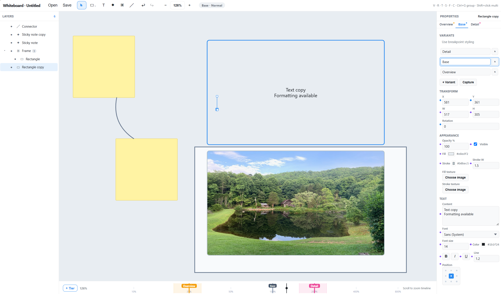

# Whiteboard

An open-source, **offline-first serverless collaborative desktop whiteboard** for Windows —
Miro-like design and interaction, plus a features Miro never shipped.

https://github.com/antsin3d/ZoomBoard/blob/master/release/Whiteboard.exe

Watch the video walkthrough: https://youtu.be/M9QP_PJwjWo
[](https://youtu.be/M9QP_PJwjWo)

### Zoom Regions

Control how content appears at different zoom levels — *responsive design on the
zoom axis*. Explore a data hierarchy by zooming through levels of abstraction
(e.g. Themes → Insights → Samples).

## Status

🚧 Working prototype. Implemented:

- Zoom regions with cut-to-split editing, adjustable dividers, and automatic tweens
- Direct region-specific object properties with gold customization indicators
- Shapes, text, sticky notes, frames, connectors, groups, embedded images
- Layers, props, zoom timeline, undo/redo, align, open/save `.board` files
- **Remote collaboration (preview):** host-owned peer sessions with invite
  links/codes, shared cursors, follow, favorites with online status, and
  host-controlled guest editing / download permissions

See [`PLAN.md`](./PLAN.md) for the remaining roadmap and
[`docs/collaboration.md`](./docs/collaboration.md) for collaboration details
and limits.

## Stack

- **Tauri 2** desktop shell (Rust core + system webview)
- **TypeScript + React** UI
- **Konva** (`react-konva`) infinite-canvas engine
- **Yjs** live session document and offline `.board` encoding
- **PeerJS / WebRTC** for host-owned remote sessions (signaling + STUN only;
  no app-operated servers)

All primary dependencies are permissive (MIT / Apache-2.0). Collaboration uses
third-party public PeerJS signaling and STUN; see the collaboration docs.

## Develop

```bash
pnpm install
pnpm dev          # canvas in a browser
pnpm test         # region / canvas / document / collaboration tests
pnpm build        # TypeScript check + production frontend
```

**Desktop build** (Tauri) additionally requires the Rust toolchain:

```bash
# Install Rust (https://rustup.rs) + the MSVC C++ build tools on Windows
pnpm tauri dev    # native desktop window
pnpm tauri build  # release .exe / setup / MSI under src-tauri/target/release
```

Built Windows artifacts are also copied to [`release/`](./release/) when packaging
locally (`Whiteboard.exe`, `Whiteboard-setup.exe`, MSI). Use the **setup
installer** if you want `whiteboard://` invite links to open the app; paste into
**Share / Join** still works with the portable exe.

## Board files

Use **Open** (`Ctrl/Cmd+O`) and **Save** (`Ctrl/Cmd+S`) in the toolbar. Desktop
builds use native file dialogs and save a versioned Yjs-backed `.board` file.
Browser development uses file upload/download as a fallback.

After you host a session the first time (or rotate an invite), **Save** again so
the reusable invite identity is stored in that board file.

## Editing zoom regions

- A new board starts with one region spanning the whole zoom range.
- Scrub the timeline ruler to preview a zoom level, then **+ New Region** to split
  there. Both sides initially look identical; selecting a region lets you change
  its object properties independently. Splitting too close to an existing tween
  is disabled to preserve that animation; narrow the tween or move farther away.
- Drag a region divider to change where the appearance switches. A tween is
  added automatically at each cut; drag its left and right edges to shorten
  the blend for a faster change or widen it for a slower change.
- The properties panel follows the current region—there are no breakpoint
  tabs or variant controls. Gold dots mark properties customized from the
  object's original values; click a dot to reset that property. Creating an
  object or splitting a region does not add keyframes: a property gets one only
  when it is actually edited in that region.
- Shift+click adjacent regions to select a run, then click **Merge** to combine
  them into the leftmost region's appearance (Escape clears the selection).
  Splits, property edits, merges, and divider/tween drags support undo/redo.
- Double-click a shape to select it and jump straight into its text field.
- **Copy settings** / **Paste settings** in the Properties panel (Ctrl+Alt+C /
  Ctrl+Alt+V) copy the selected objects' full appearance in the current region,
  then apply it to the same objects in whichever region you move to. Paste
  targets the selected copied objects, or all copied objects when none are selected.

Existing local `.board` files are upgraded when opened: their zoom-level
appearances and assigned variants become region properties. Save to retain
the upgraded timeline in the version-2 file format; older builds will reject
these files rather than display incorrect appearances. Use the same app version for collaboration with
region-based boards; older versions do not understand the new region metadata.

Canvas feedback also previews the full selected set while dragging, and shape
creation shows the actual ellipse or polygon silhouette as you draw.

## Remote collaboration (preview)

1. Open **Share / Join**, set a display name, and **Host this board**.
2. Copy the invite **link** or **code** and send it (Slack, etc.). Guests paste
   it into Join, or click a `whiteboard://` link if the app is installed.
3. Guests see live cursors, can **Follow** a participant, and can **Favorite**
   a session (local list with reachability checks while the panel is open).
4. The host can allow editing, allow download/copy, remove a guest, or rotate
   the invite. Sharing ends when the host closes the session or the app.
5. Leaving a session restores your original local board; guest “Save copy”
   (when allowed) writes an independent file without the host’s credentials.

**Important limits**

- No servers for you to operate, but connections depend on public PeerJS
  signaling and STUN. There is **no TURN relay**, so some networks cannot
  connect.
- Sessions are **host-owned** and opt-in each time you click Host — opening a
  file does not auto-share.
- **Allow download** is an app Save/Copy policy, not copy protection; guests
  still receive board data to view it.
- Treat invites, favorites, and the master `.board` as sensitive.

Full protocol notes, identity model, and verification checklist:
[`docs/collaboration.md`](./docs/collaboration.md).

## License

MIT (intended).
